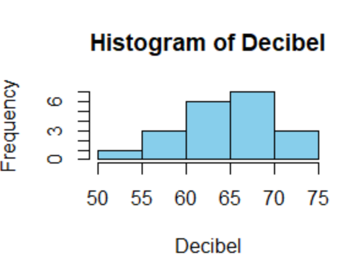
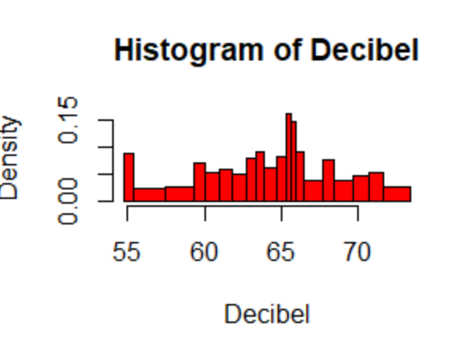
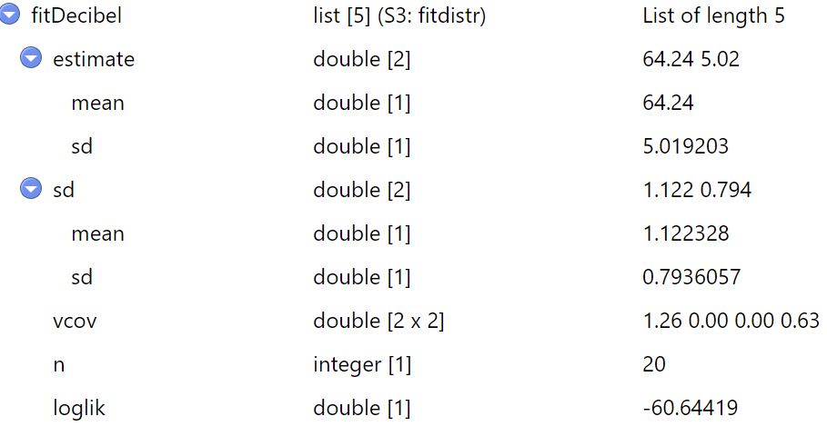

# EXERCICE 1

Cet exercice étudie le niveau de bruit émis par des véhicules dans une rue de Montréal

### Question 1

```
Decibel <- c(54.8,55.4,57.7,59.6,60.1,61.2,62,63.1,63.5,64.2,65.2,65.4,65.9,66,67.6,68.1,69.5,70.6,71.5,73.4)
```

> Moyenne
```R
moyenne <- mean(Decibel)

output: 64.24
```
> Médiane
```R
median(Decibel)

output: 64.7
```
> Variance
```
var(Decibel)

output: 26.51832
```
> Ecart-type
```
ecart <- sd(Decibel)

output: 5.1495937499451
```
> Coefficients de variation
```
coefV <- ecart/moyenne

output: 0.0801617956093572
```
> Quartiles empiriques
```
quantile(Decibel)

output:
   0%    25%    50%    75%   100% 
54.800 60.925 64.700 67.725 73.400 
```

### Question 2

- histogramme à classes de même largeur
```
hist(Decibel, col = "skyblue", right = FALSE )
```


- histogramme à classes de même effectif
```
breaks <- c(54.8, quantile(Decibel,seq(1,19)/20),73.4) 
hist(Decibel, breaks, col = "red")
```


### Question 3
On suppose que l'échantillon Decibel est issu d'une loi normale
- Estimation de la moyenne et de la variance d'un tel échantillon

*Pour ce faire, il faut dans un premier temps déterminer une loi normale à notre échantillon*.

On se servira ainsi de la fonction **fitdistr** de la library **MASS**.
```
fitDecibel <- fitdistr(Decibel, densfun="normal")
```
output:


L'estimation de la moyenne est **64.24** et celle de la variance est le carrée l'écart-type obtenu soit **25,2**

- Probabilité que le niveau de bruit dépasse 70db.

On suppose que X soit la variable aléatoire de notre distribution normale représentant le niveau de bruit émis par les voitures.

on veut donc calculer **P(X>70)**
P(X>70)=1-P(0<X<70)
```
1-pnorm(70, mean=64.24, sd=5.02)

output: 0.125606
``` 
La probabilité que le niveau de bruit dépasse 70db est de *12,56%*

- Probabilité que le niveau de bruit dépasse 74db

On suit le même raisonnement que précédemment pour **P(X>74)**

```
1-pnorm(74, mean=64.24, sd=5.02)

output:0.02593428
```
La probabilité que le niveau de bruit dépasse 74db est de *2,6%*

- Niveau de bruit limite au delà duquel les 10% de véhicules les plus bruyants auront une amende

*il suffit de déterminer le niveau de bruit des 90% de véhicules les __moins bruyants__ en utilisant la 
 fonction qnorm. Cette dernière est l'inverse de pnorm*
 ```
 qnorm(0.90, mean=64.24, sd=5.02)

 output: 70.67339
 ```
 Le niveau de bruit seuil est donc de *70,67db*

 Remarque: On peut toutefois déterminer ce niveau de bruit seuil directement avec les 10% les plus bruyants. il suffit pour celà 
 de juste rajouter le paramètre lower.tail à qnorm
 ```
 qnorm(0.10, mean=64.24, sd=5.02, lower.tail=FALSE)

 output: 70.67339
 ```